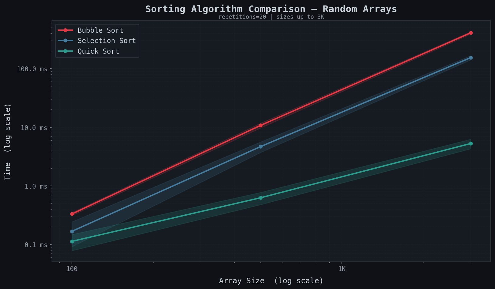
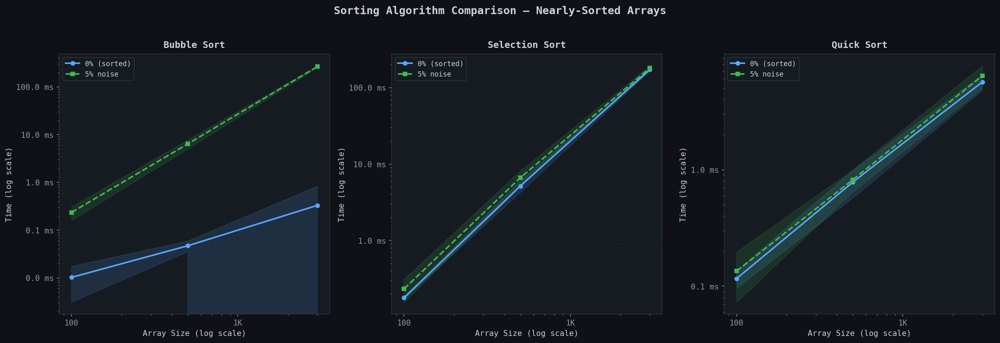

# Sorting Assignment

**Student Name:** Roi Aviram and Yotam Wais

**Selected Algorithms:** Bubble Sort, Merge Sort, Quick Sort

---

## Part B - Comparative Experiment (Random Arrays)

**Explanation:**
The plot demonstrates the vast difference in growth rates between $O(N^2)$ and $O(N \log N)$ sorting algorithms. Bubble sort, an $O(N^2)$ algorithm, quickly becomes impractically slow as the array size scales up, which is why its time shoots up significantly for relatively small sizes and must skip calculations over a few thousand elements. In contrast, Merge Sort and Quick Sort scale efficiently, processing arrays of hundreds of thousands of elements in a fraction of a second, demonstrating the sheer superiority of $O(N \log N)$ algorithms.

---

## Part C - Experiment with Noise or Partial Order (Nearly Sorted Arrays)

**Explanation:**
The second experiment explores how partial ordering affects algorithm performance:
- **Bubble Sort:** Takes maximum advantage of already-sorted elements because it has an early-exit optimization (`O(N)` best case). When $0\%$ noise is added, it completes near instantly. When noise increases (5% and 50%), the early exits vanish and it falls back dramatically to $O(N^2)$ performance. 
- **Merge Sort:** Maintains a highly consistent $O(N \log N)$ time regardless of the noise level. This is expected because Merge Sort's divide-and-conquer strategy inherently cuts the array in half and merges uniformly without inspecting data pre-ordering.
- **Quick Sort:** Time is consistent because a randomized pivot was implemented. Regardless of whether the array is completely sorted, 5% noisy, or randomly shuffled, the pivot ensures consistent $O(N \log N)$ average performance and avoids its worst-case scenario.
